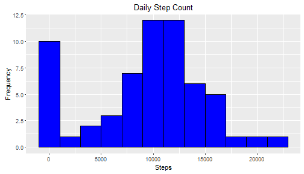
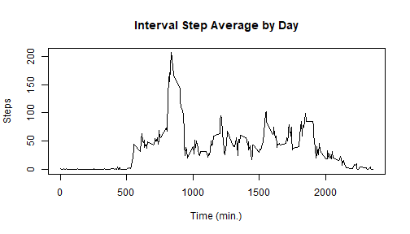
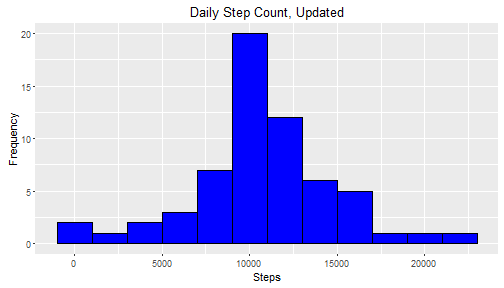
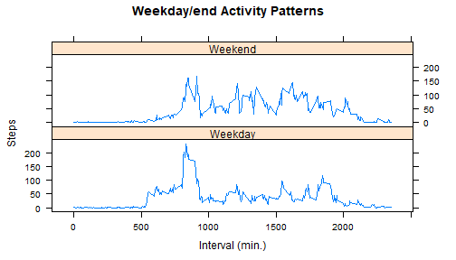

# Reproducible Research Project 1

In this project, I will be loading a movement dataset and doing various analyses, shown below.

## Loading and preprocessing the data

First, I'll load any necessary packages and download the data if it hasn't been already, then load it using load.csv().


```r
# Load necessary packages
install.packages(c("ggplot2", "plyr", "dplyr"))
```

```
## Installing packages into 'C:/Users/vonwa/OneDrive/Documents/R/win-library/3.3'
## (as 'lib' is unspecified)
```

```
## package 'ggplot2' successfully unpacked and MD5 sums checked
## package 'plyr' successfully unpacked and MD5 sums checked
## package 'dplyr' successfully unpacked and MD5 sums checked
## 
## The downloaded binary packages are in
## 	C:\Users\vonwa\AppData\Local\Temp\RtmpWu46nO\downloaded_packages
```

```r
library("ggplot2"); library("plyr"); library("dplyr")
```

```
## 
## Attaching package: 'dplyr'
```

```
## The following objects are masked from 'package:plyr':
## 
##     arrange, count, desc, failwith, id, mutate, rename, summarise,
##     summarize
```

```
## The following objects are masked from 'package:stats':
## 
##     filter, lag
```

```
## The following objects are masked from 'package:base':
## 
##     intersect, setdiff, setequal, union
```

```r
# Check for the data
if(!file.exists("activity.csv")){
        download.file("https://d396qusza40orc.cloudfront.net/repdata%2Fdata%2Factivity.zip", destfile = "Data.zip")
        unzip("Data.zip")
        file.remove("Data.zip")
}

# Read in the data
activity <- read.csv("activity.csv", colClasses = c("integer", "Date", "integer"))
```

## What is the mean total number of steps taken per day?

Let's make a histogram of the total number of steps taken each day, and calculate the mean/median of the total steps taken per day.


```r
# Find the total steps each day
dailytotalsteps <- with(activity, tapply(steps, date, sum, na.rm = TRUE))
# Make a histogram of the total steps
qplot(dailytotalsteps, geom = "histogram", binwidth = 2000, main = "Daily Step Count", xlab = "Steps", ylab = "Frequency", fill = I("blue"), col = I("black"))
```



```r
# Calculate mean and median metrics
meansteps <- format(round(mean(dailytotalsteps), digits = 0), scientific = FALSE)
mediansteps <- format(round(median(dailytotalsteps), digits = 0), scientific = FALSE)
```

The mean and median number of steps taken each day are 9354 and 10395, respectively.

## What is the average daily activity pattern?

Now we'll find the number of steps taken for each 5 minute interval, averaged across all days


```r
# Find the average steps for each interval
intervalsteps <- with(activity, tapply(steps, interval, mean, na.rm = TRUE))

# Plot the average
plot(as.integer(names(intervalsteps)), intervalsteps, type = "l", main = "Interval Step Average by Day", xlab = "Time (min.)", ylab = "Steps")
```



```r
# Find the interval with the largest number of steps on average
maxintervalsteps <- round(max(intervalsteps), digits = 0)
maxinterval <- as.integer(names(which.max(intervalsteps)))
```

The interval starting at minute 835 has the largest number of steps with 206 on average across the days studied.

## Imputing missing values

Below I will impute missing NA values with the average number of steps for the given interval from the other days.


```r
# Find the number of NA values
missing <- sum(is.na(activity$steps))

# Replace NA values with the average for that interval over the days studied
stepsV2 <- activity$steps
stepsV2[is.na(stepsV2)] <- intervalsteps
activityV2 <- mutate(activity, steps = stepsV2)

# Make a plot of the new total steps
dailytotalstepsV2 <- with(activityV2, tapply(steps, date, sum, na.rm = TRUE))
qplot(dailytotalstepsV2, geom = "histogram", binwidth = 2000, main = "Daily Step Count, Updated", xlab = "Steps", ylab = "Frequency", fill = I("blue"), col = I("black"))
```



```r
# Find the mean and median of the new total steps for each day
meanstepsV2 <- format(round(mean(dailytotalstepsV2), digits = 0), scientific = FALSE)
medianstepsV2 <- format(round(median(dailytotalstepsV2), digits = 0), scientific = FALSE)
```

The number of missing (NA) values before imputing was 2304.

The new mean and median total steps for each day after imputing the NA values are 10766 and 10766, compared to 9354 and 10395 before imputing. As you can see, both values are higher after imputing because the original mean and median were calculated by omitting the NA values (see above).

One with imputing NA values with the average for the interval is that there are several days that have all NA values, so each interval will assume the average for that interval from all the other days. As a result there are a number of days that have the same total steps, which may not be an accurate interpretation of days that have only NA values. This edit can only cause the total number of steps for each day to increase, as any non-NA value will contribute to the total steps, unlike an NA value.

## Are there differences in activity patterns between weekdays and weekends?


```r
# Assign days of the week
weekdayorweekend <- weekdays(activityV2$date)

#Assign weekday or weekend and add as new column in the imputed dataset
weekdayorweekend[weekdayorweekend %in% c("Monday", "Tuesday", "Wednesday", "Thursday", "Friday")] <- "Weekday"
weekdayorweekend[weekdayorweekend != "Weekday"] = "Weekend"
weekdayorweekend <- as.factor(weekdayorweekend)
activityV3 <- activityV2 %>% mutate(WeekdayorWeekend = weekdayorweekend)

# Find the average number of steps for each interval across the weekdays and weekends and plot it
WeekdayActivity <- filter(activityV3, WeekdayorWeekend == "Weekday")
WeekendActivity <- filter(activityV3, WeekdayorWeekend == "Weekend")
WeekdayIntervals <- with(WeekdayActivity, tapply(steps, interval, mean))
WDIntdf <- data.frame(AvgSteps = WeekdayIntervals, Interval = as.integer(names(WeekdayIntervals)), WeekdayorWeekend = "Weekday")
WeekendIntervals <- with(WeekendActivity, tapply(steps, interval, mean))
WEIntdf <- data.frame(AvgSteps = WeekendIntervals, Interval = as.integer(names(WeekendIntervals)), WeekdayorWeekend = "Weekend")
CombinedIntervals <- rbind(WDIntdf, WEIntdf)
with(CombinedIntervals, xyplot(AvgSteps~Interval|WeekdayorWeekend, type = "l", layout = c(1,2), main = "Weekday/end Activity Patterns", xlab = "Interval (min.)", ylab = "Steps"))
```



As we can see, there are some significant differences between weekday and weekend activity patterns, with on average higher activity during the weekend.
